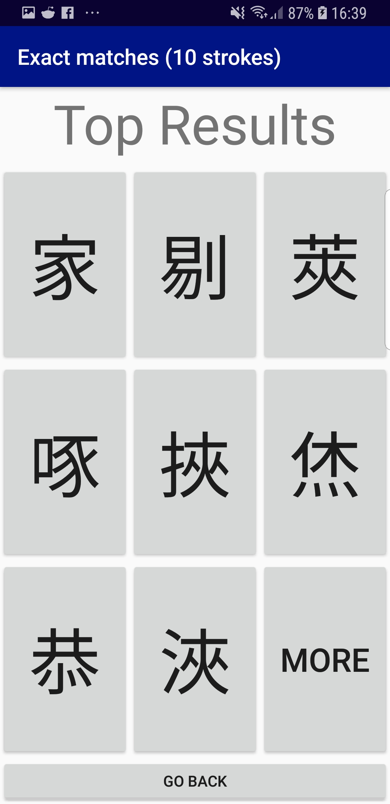
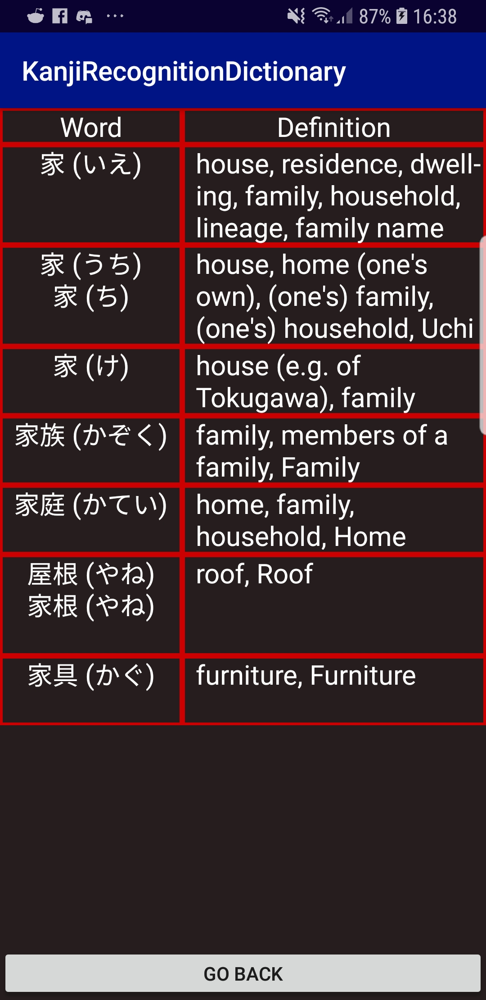

# KanjiRecognitionDictionary
Forgetting kanji pronunciation? Not sure about your stroke orders? Or maybe you just want to know what a word means?  
Use this Kanji Recognition App! It automatically detects your strokes which makes it so much easier to look up a definition!
This app supports English, Kanji, Hiragana, and Katakana inputs. So you can search using either language and lookup the meanings in both Japanese and English!

# Installation Procedure
It's really simple!  
1. Go to "Releases"
2. Download KanjiRecognizer.apk
3. Run the app!

Make sure you update your android settings to allow installation from Chrome sources.
